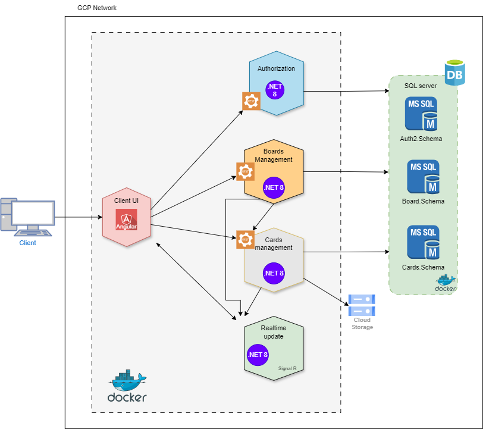

# Manto
The acronym of this project name is for management tool. 

## Project overview
I wanted to build a project that would be useful for me to build other projects, so I decided to build a management tool. 

What you will see in this project?
The project will have the following *architecture/practices/tools/frameworks/etc*: 
* [Microservices architecture](#microservices-architecture)
    * [Authentication Service](#authorization-service)
    * [Boards Service](#boards-service)
* [DBMS (SQL Server - Multi Schema)](#database---sql-server) 
* [Git branching strategy](#branching-strategy)
* .NET 8 (web API, Signal R)
* Angular 17
* SOLID Principles
* Design patterns
* OWASP
* REST API standards
* Authentication and Authorization (Using JWT Bearer)
* Unit testing (XUnit)
* CI/CD

## Microservices architecture
I chose this architectural pattern to address non-functional requirements such as scalability and maintainability. Additionally, I decided to follow microservices principles by allowing each microservice to have its own database schema.

The architecture will have the following microservices:
* Authentication
* Boards management
* Cards management
* Realtime updates

Every microservice will have its own separate data storage, thats why every microservice will have its own **Schema** on the same database.

### Authentication Service
This microservice is a Restful Web API that allows clients to create an account and handle login operations. Upon a successful login, the service issues a JWT (JSON Web Token) to the user.

The service uses asymmetric encryption to generate JWTs, involving a pair of private and public keys. Only the public key will be shared to the microservices to enforce security.

### Boards Service
This microservice is a Web API that allows user to manage their boards and projects. 

This service has its own middleware, that will use the public key from the asymmetric key in order to determine if the JWT used by the user is issued by the Authentication Service.

This service also uses ENV variables for **configuration**. You can check the appSettings to determine the variables it requires. 

## Branching strategy
All microservices will be host in a single Github repository (mono-repo). In my case I choose mono-repo because im a single person working on the whole project, so it will be easiear to handle and also to deploy changes. 

The Git branching strategy that I will use is called **GitHub flow**, where the main branch is always production-ready, and any change on this branch will trigger the CI/CD process.

## .NET 8 (.NET Core)
I Choose to use **.NET 8** because it offers cross-platform development, Long term support (LTS), and also brings the support for the new C# 12, which offers a new simplified sintaxis and improvements to performance. 

The project templates that I will use are: 
* ASP.NET Core - Web API

## CI/CD
One of the most useful things to streamline software development is the ability to automate workflows/human processes. This project will use Github actions to automate continuous integration and continuous delivery commonly known as CI/CD pipeline.
To track the current state of Github actions use 
* https://www.githubstatus.com/ 

### Continuous Integration
The continuous integration process will trigger everytime the main branch receives a pull request from a feature branch, activating the following workflows:
* Build
* Test

### Continuous Deployment
Once the administrator validates that the build and test from the pull request are successful, he can merge the feature into the main branch. Once the main branch receives the merge, github actions will automatically trigger the CD pipeline, activating the following workflows:
* Deploy 
* Run

## Database - Sql Server

Each microservice in this architecture has ownership over the database tables it operates on.

Given the following Entity-Relationship Diagram (ERD), there are instances where a table from one schema may have relationships with entities from another schema. These cross-schema relationships are crucial for maintaining data integrity and enabling efficient data access across different microservices.

In order to implement this in SQL Server, I used Transact-SQL (T-SQL) following the next steps.
1) Create a new datatabase user
2) Create a login for the new User
3) Assign permission to the User
4) Create a new Schema and set the User as the owner.